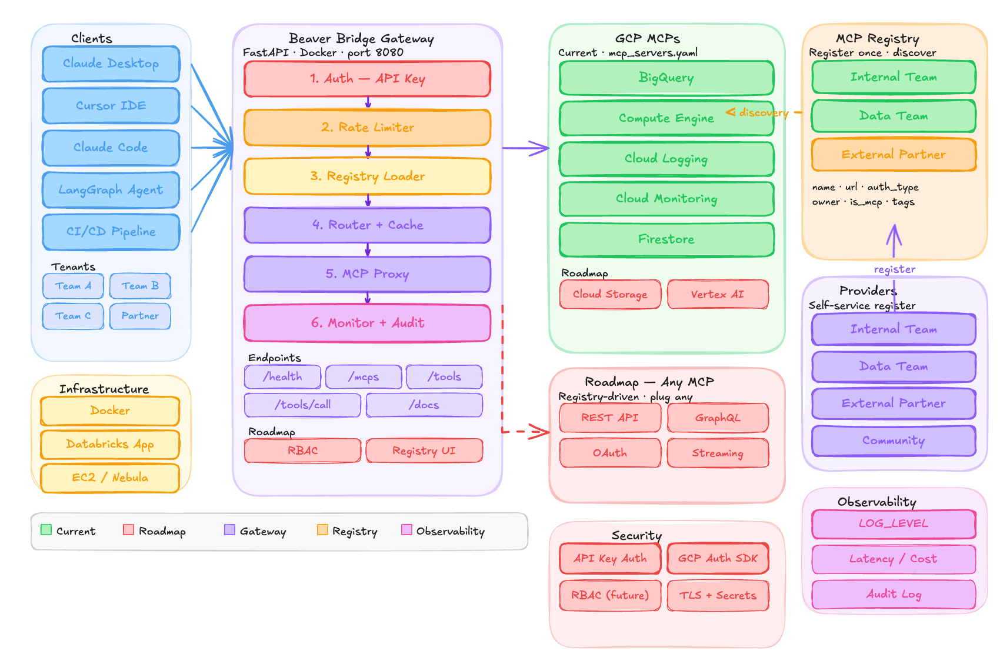
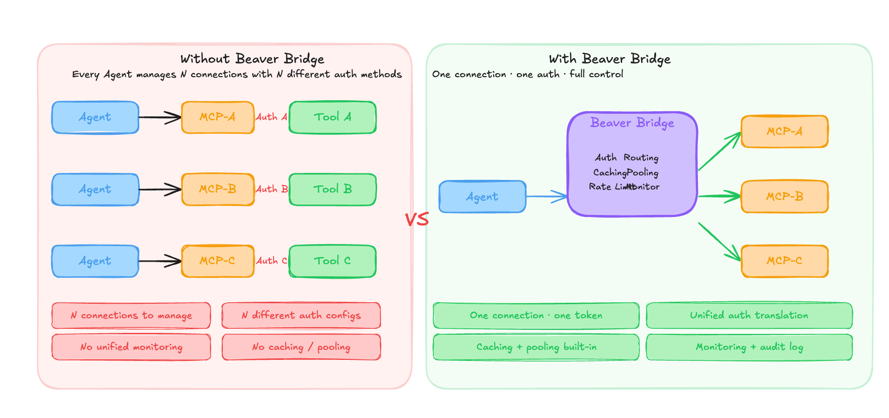

# Beaver Bridge

A unified **MCP (Model Context Protocol) Gateway** that consolidates multiple MCP servers into a single platform. Designed as a foundation for **AI agents** to seamlessly access and orchestrate diverse data sources and tools.

## Vision

Beaver Bridge is a **context platform for agents**. Instead of agents juggling multiple MCP connections, they talk to a single gateway that handles authentication, routing, orchestration, and observability. This allows agents to focus on reasoning, not infrastructure.

---

## Core Features

### 1. **Unified Server Management**

- Register and manage multiple MCP servers (Google Cloud, Databricks, custom, etc.)
- YAML-based configuration
- Hot-add/remove servers without restart

### 2. **Enterprise Authentication**

- **Multiple auth types**: Google Access Token, Google ID Token, Bearer Token, None
- **API Key validation** for client access
- **Audit logs** for security tracking

### 3. **Interactive Tools**

- **Tool Explorer**: Browse all available MCP tools and resources
- **Playground**: Test MCP tools in real-time
- **Resource viewer**: Preview MCP resources

### 4. **Observability**

- Real-time server health status
- API metrics (latency, success rate, errors)
- Rate limiting with SlowAPI

### 5. **Dashboard**

- Overview of all MCP servers
- Tool search and filtering
- Metrics visualization

---

## Architecture


## API Endpoints

```
List all MCP servers
  GET /mcps

Get server details
  GET /mcps/{name}

List tools for a server
  GET /mcps/{name}/tools

Call a tool
  POST /mcps/{name}/call-tool

Check server status
  GET /mcps/{name}/status
```

---

## Configuration

YAML-based server configuration:

```yaml
servers:
- name: bigquery
  display_name: BigQuery
  url: https://bigquery.googleapis.com/mcp
  auth:
    type: google_access_token
  provider: Google Cloud
  enabled: true
  tags: [data, sql]
```

---

## Quick Start

```bash
# Install dependencies
pip install -e .

# Set environment variables
export API_KEYS=your-api-key
export MCP_REGISTRY_PATH=config/mcp_servers.yaml

# Run backend
uvicorn app.main:app --reload --port 8000

# Run frontend (in another terminal)
cd frontend && npm install && npm run dev

# Open http://localhost:5173
```

---

## Security

- **API Key authentication** with constant-time comparison
- **Audit logs** for all auth failures
- **Rate limiting** to prevent abuse
- **Public endpoints**: `/health`, `/docs`, `/openapi.json`

---

## Performance

- **Token caching**: Reduces repeated auth calls
- **Connection pooling**: Reuses MCP connections
- **Async operations**: Fast, non-blocking API responses
- **Status caching**: Background health checks with cache

---

## Deployment

```bash
# Using Docker
docker build -t beaver-bridge .
docker run -p 8000:8000 \
  -v $(pwd)/config:/app/config \
  -e API_KEYS=your-api-key \
  beaver-bridge
```

---

## Tech Stack

**Backend**

- FastAPI 0.111+
- Python 3.11+
- MCP 1.9+
- Pydantic for validation

**Frontend**

- React 18+
- TypeScript
- Vite

---

## Why Beaver Bridge?



**Benefits:**

- Agents focus on reasoning, not infrastructure
- Unified authentication and access control
- Single observability point
- Easier to scale and maintain
- Foundation for more advanced agent features
